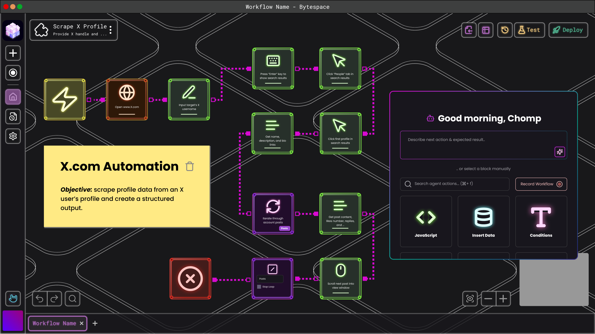

export const NeonCard = ({ 
  href, 
  icon, 
  alt,
  borderColor = '#9BFB3B',
  glowColor = '#9BFB3B',
  backgroundColor = '#27302A',
  innerBackgroundColor = '#101813',
  innerShadowColor1 = '#2B4F28',
  innerShadowColor2 = '#3D7832',
  iconFilter  // Optional prop for direct filter value
}) => {
  if (typeof window === 'undefined') {
    return null
  }

  return (
    

      <a href={href} className="no-underline block" style={{ minWidth: '60px' }}>
        
 {
          e.currentTarget.style.boxShadow = `0 0 5px ${glowColor}, 0 0 10px ${glowColor}`;
        }}
        onMouseOut={(e) => {
          e.currentTarget.style.boxShadow = 'none';
        }}>
          

            
          

        

      </a>
    

  )
}

### What Exactly is the Builder?

A Chrome extension that lets you create, test, and run automations directly in your browser. No APIs, no backend integrations—just seamless automation that works exactly like a human would.

### What Can You Do in the Builder?
Design automations visually—click, select, and build workflows without code.
Run and test locally before deploying to the Bytespace marketplace.
Leverage your real browsing environment—using your logins, cookies, and authentication data to bypass captchas, 2FA, and other security roadblocks.
The Builder is built for precision. Unlike AI tools that make unpredictable decisions, Bytespace gives you complete control—ensuring your automations run exactly as expected, every time.

Now that you know what the Builder is, let's dive into how to actually build an automation.

<Frame>
  
</Frame>

### How do you build automations? 

<CardGroup cols={13} className="flex flex-row gap-4">
  <NeonCard 
    href="/web-agent-builder/navigation/New-Tab"
    icon="mouse-pointer"
    alt="New Tab"
  />
  
  <NeonCard 
    href="/bytespacedocs/new-to-bytespace/tools/element-selector"
    icon="element-selector"
    alt="Element Selector"
    borderColor="#BE48E6"
    glowColor="#BE48E6"
    backgroundColor="#2A1F2E"
    innerBackgroundColor="#1F1623"
    innerShadowColor1="#4A2D56"
    innerShadowColor2="#6E3B8A"
  />
  
  <NeonCard 
    href="/web-agent-builder/navigation/Switch-Tab"
    icon="arrows-split-up-and-left"
    alt="Switch Tab"
    borderColor="#3B9BFB"
    glowColor="#3B9BFB"
    backgroundColor="#1F2A2E"
    innerBackgroundColor="#162023"
    innerShadowColor1="#2D4A56"
    innerShadowColor2="#3B6E8A"
  />
</CardGroup>

### **Web-Agent Builder & Chrome Extension**

Our builder and chrome extension use a combination of AI, XPath, and CSS selectors to identify elements on a web page. You can choose these selectors manually, or let our AI do the work for you. 

- **XPath:** A language used to navigate a webpage's structure by defining a precise path to elements, such as "Select the third item in the second list."
- **CSS Selector:** A method to select elements on a webpage based on their styles, attributes, or tags, like "Find the red button or the heading with bold text."
- **AI Selection & Enhancement:** AI interprets natural language prompts to accurately identify and select the right elements on a webpage, combining XPath and CSS to choose the most reliable selectors.

  

    Builder Interface
  

  

    Chrome Extension
  

